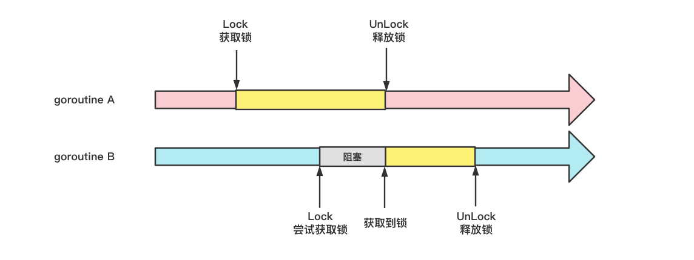

# 互斥锁与读写锁

## 简介

> 不要用共享内存来通信，要用通信来共享内存。

在Golang中channel属于first class级别，在实际编程中我们应该优先使用它来解决并发问题。当遇到channel无法解决的并发问题时，我们就可以用共享内存来实现并发编程，最常用的便是互斥锁（Mutex，全称mutual exclusion）和读写锁（RWMutex）。

## 互斥锁

#### 1. 简介

当一个goroutine获取到Mutex权限后，如果其他goroutine请求获取该Mutex会阻塞在Lock方法，直到占用该Mutex的goroutine调用Unlock方法释放锁。



#### 2. 使用

Mutex提供的接口如下：

* `Lock()`：加锁
* `Unlock()`：解锁

假设我们需要对一个变量并发累加1000次，那么可以使用Mutex实现加锁：

```go
package main

import (
	"fmt"
	"sync"
	"time"
)

func main() {
	var x int
	var locker sync.Mutex

	for i := 0; i < 1000; i++ {
		go func() {
			// 加锁
			locker.Lock()
			x++
			// 解锁
			locker.Unlock()
		}()
	}

	time.Sleep(1 * time.Second)
	fmt.Println("x: ", x)
}

// 输出:
x:  1000
```

## 读写锁

#### 1. 简介

读写锁相较于互斥锁而言有一定的性能提升，应对的是单写多读模型：

* 读锁占用：阻塞写但不阻塞读
* 写锁占用：同时阻塞读和写

#### 2. 使用

RWMutex提供的接口如下：

* `Lock()`：写锁定
* `UnLock()`：写解锁
* `RLock()`：读锁定
* `RUnlock()`：读解锁

假设我们需要高并发读写一个map，那么可以使用读写锁封装一个线程安全的map：

```go
package main

import (
	"fmt"
	"strconv"
	"sync"
)

// SafeMap 并发读写安全的map
type SafeMap struct {
	locker sync.RWMutex
	m map[string]string
}

// get 读map
func (sm *SafeMap) get(key string) (value string, ok bool) {
	sm.locker.RLock()
	value, ok = sm.m[key]
	sm.locker.RUnlock()
	return
}

// set 写map
func (sm *SafeMap) set(key string, value string) {
	sm.locker.Lock()
	sm.m[key] = value
	sm.locker.Unlock()
}

// NewSafeMap SafeMap构造函数
func NewSafeMap(size int) (sm *SafeMap) {
	sm = &SafeMap{}
	sm.m = make(map[string]string, size)
	return
}

func main() {
	wg := sync.WaitGroup{}
	wg.Add(20000)

	sm := NewSafeMap(10000)

	// 10000个协程写map
	for i := 0; i < 10000; i++ {
		go func(index int) {
			defer wg.Done()
			sm.set(strconv.Itoa(index), strconv.Itoa(index * index))
		}(i)
	}

	// 10000个协程读map
	for i := 0; i < 10000; i++ {
		go func(index int) {
			defer wg.Done()
			key := strconv.Itoa(index)
			value, ok := sm.get(key)
			fmt.Printf("ok:%t key:%s value:%s\n", ok, key, value)
		}(i)
	}
	
	wg.Wait()
}
```


