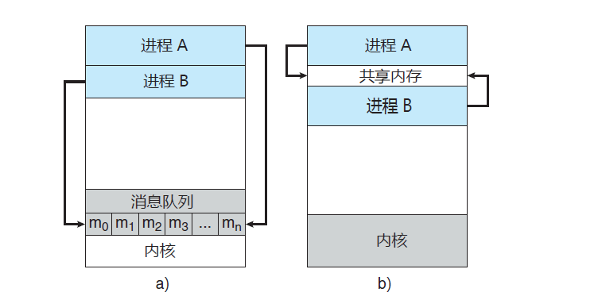

# 并发通信与channel

## 并发通信模型

#### 1. 进程的独立与协作

操作系统内的并发执行既可以是独立的也可以是协作的：

* 如果一个进程不能影响其他进程或受其他进程影响，则该进程是独立的
* 如果一个进程能影响其他进程或受其他进程所影响，则该进程是协作的

操作系统允许进程协作主要是出于如下原因：

* 信息共享：多个进程可能需要访问相同的信息（例如共享文件）
* 计算加速：如果希望一个特定任务加速执行，可以将其切成多个子任务并发执行（注意这种情况下需要多核计算机才能实现加速）d
* 模块化：模块化系统可以将系统功能拆分成多个独立的进程或线程
* 并行化：即使是单个用户也可以同时执行多个任务，比如灵敏响应的图形用户界面

#### 2. 并发通信模型

在工程开发中，“共享数据”和“消息队列”是两种最常见的并发通信模型：

* 共享数据：建立起一块供协作进程共享的内存区域，进程通过此内存区域读写数据来交换信息
* 消息队列：在协作线程间交换消息来实现通信




> Tips：消息传递无需避免冲突，常用于交换少量的数据，对于分布式系统而言消息传递也比共享内存更容易实现。共享内存一般快于消息传递，因为消息传递的实现通常借助于系统调用从而消耗更多时间以便内核介入，而共享内存系统仅仅在建立共享内存区域时需要系统调用，一旦建立共享内存则所有访问都可作为常规内存访问（无须借助内核）。

## channel

#### 1. 简介

channel是Go语言在语言层面提供的goroutine间的通信方式。channel是进程内的通信方式，因此通过channel传递对象的过程和调用函数时的参数传递方式比较一致（也可以传递指针）。如果需要跨进程通信，我们建议用分布式系统的方法来解决（比如使用Socket或者HTTP等通信协议）。

#### 2. 定义与使用

channel是类型相关的，即一个channel只能传递一种类型的值 ，可以将channel认为是一种类型安全的Unix管道。

```go
// 声明一个channel, 此时ch值为nil, 必须要使用make进行初始化才能继续使用
var ch chan int

// 使用make进行初始化: 无缓冲的channel用于同步操作
ch = make(chan int)

// 往channel中发送数据
ch <- 42

// 从channel中取出数据
res := <-ch
```

#### 3. 关闭channel

channel使用完了之后可以关闭，避免有人一直在等待它。当你关闭channel后，接收方仍然可以从channel中取出数据，当发送给channel的数据被完全取出后，接收方就会取出零值。例如：

```go
package main

import (
	"fmt"
)

func main() {
	ch := make(chan int, 2)
	// 往channel中发送数据
	ch <- 123
	ch <- 321

	// 关闭channel
	close(ch)

	// 从channel中取出10个数据
	for i := 0; i < 10; i++ {
		fmt.Println(<-ch)
	}
}

// 输出:
123
321
0
0
0
0
0
0
0
0
```

关闭一个已经关闭的channel是会报错的，当从一个channel中读取数据时可以有多个返回值，第二个返回值可以表示channel是否被关闭：

```go
// ok为false时表示channel已被关闭, 此时res为零值
res, ok := <-ch
```

#### 3. 容量与长度

使用make函数初始化channel时需要传递两个参数：

* 第一个参数：必填，指定channel类型
* 第二个参数：选填，表示channel的容量（可缓存的数据量，不填时默认为0）

对于channel的容量需要注意如下几点：

* 容量为0：无缓冲channel，在发送数据时必须同步接收数据，否则会报错`fatal error: all goroutines are asleep - deadlock!`
* 容量为1：只能缓存一个数据的channel，若channel中已经有一个数据则无法再往channel中发送数据（阻塞程序），可以基于此特性实现锁功能
* 容量大于1：可以缓存多个数据的channel，用于多个协程之间共享资源

```go
package main

import "fmt"

func main() {
	ch := make(chan int, 5)
	fmt.Printf("channel capacity: %d\n", cap(ch))

	ch <- 1
	ch <- 2
	fmt.Printf("channel length: %d\n", len(ch))
}

// 输出:
channel capacity: 5
channel length: 2
```

#### 4. 缓冲与非缓冲channel

按照channel容量可将其分为缓冲channel和非缓冲channel：

* 缓冲channel：允许存储一个或多个数据，设置缓冲区后发送端和接受端可以处于异步的状态
* 非缓冲channel：在channel中无法存储数据，向无缓冲channel中写入数据会导致程序阻塞，直到有其他goroutine从这个channel中读取数据（即意味着发送端和接收端必须是同步运行的）

```go
// 缓冲channel
ch := make(chan int, 10)

// 非缓冲channel
ch := make(chan int)
ch := make(chan int, 0)
```

#### 5. 双向与单向channel

一般情况下我们定义的channel都是双向的（即可以发送数据也可以接受数据），我们也可以对channel的数据流向做一些控制（只能发送数据或者只能接受数据），这些channel被称为单向channel。

> 所谓的单向channel概念指的是对创建好的双向channel的是一种使用限制（只读或者只写）。不存在完全的单向channel，因为一个只读channel必定是空的（没人往channel里写数据），一个只写channel也没有意义（没人从channel读数据）。

```go
package main

import (
	"fmt"
	"time"
)

// 定义只读channel类型
type Receiver <-chan int

// 定义只写channel类型
type Sender chan<- int

func main() {
	ch := make(chan int)

	go func() {
		var sender Sender = ch
		sender <- 123
		fmt.Println("send data: 123")
	}()

	go func() {
		var receiver Receiver = ch
		fmt.Println("receive data: ", <-receiver)
	}()

	time.Sleep(1 * time.Second)
}

// 输出:
receive data:  123
send data: 123
```

单向channel一种常用的场景是：当我们通过函数传递channel时，可以将其指定为只读或者只写的单向channel变量，进而限制该函数对channel的操作，实现“权限最小化原则”。

```go
package main

import (
	"fmt"
	"sync"
)

// sendToChan 向channel中写入int
func sendToChan(ch chan<- int, i int) {
	ch <- i
}

// receiveFromChan 获取channel中所有数据
func receiveFromChan(ch <-chan int) {
	for value := range ch {
		fmt.Println("receive from ch: ", value)
	}
}

func main() {
	ch := make(chan int, 10)

	var wg sync.WaitGroup
	wg.Add(10)
	for i := 0; i < 10; i++ {
		go func(index int) {
			sendToChan(ch, index)
			wg.Done()
		}(i)
	}
	wg.Wait()

	close(ch)

	receiveFromChan(ch)
}

// 输出:
receive from ch:  0
receive from ch:  1
receive from ch:  9
receive from ch:  5
receive from ch:  6
receive from ch:  8
receive from ch:  7
receive from ch:  3
receive from ch:  4
receive from ch:  2
```

#### 6. 遍历channel

可以使用for搭配range关键字遍历channel，注意写完数据后需要手动close掉channel，否则主线程会阻塞住：

```go
package main

import "fmt"

func main() {
	// 创建无缓冲channel
	ch := make(chan int)

	// 向channel中写入数据
	go func() {
		for i := 0; i < 10; i++ {
			ch <- i * i
		}
		// 如果不关闭channel, 则主线程会阻塞住
		close(ch)
	}()

	// 遍历channel获取数据
	for num := range ch {
		fmt.Println("num is ", num)
	}
}

// 输出:
num is  0
num is  1
num is  4
num is  9
num is  16
num is  25
num is  36
num is  49
num is  64
num is  81
```

#### 7. 使用channel实现锁

当channel缓冲区已满时再往里发送数据会阻塞，利用这个性质我们可以实现锁逻辑：

```go
package main

import (
	"fmt"
	"time"
)

func main() {
	// 实现x累加到1000
	var x int

	// 构造容量为1的channel作为锁
	var lockCh = make(chan bool, 1)

	for i := 0; i < 1000; i++ {
		go func() {
			// 加锁
			lockCh <- true
			x++
			// 解锁
			<-lockCh
		}()
	}

	time.Sleep(1 * time.Second)
	fmt.Println("x: ", x)
}

// 输出:
x:  1000
```

> Tips：i++非原子性操作，如果上述例子不加锁则最终输出的x值会低于1000，感兴趣可以补充阅读相关资料。

#### 8. 使用channel实现goroutine的超时控制

当我们需要对创建的goroutine进行超时控制时，可以使用select和channel来实现：

```go
package main

import (
	"fmt"
	"time"
)

func main() {
	ch := make(chan int, 1)

	timeout := make(chan bool, 1)
	go func() {
		time.Sleep(1 * time.Second)
		timeout <- true
	}()

	select {
	case <-ch:
		fmt.Println("receive from ch successfully")
	case <-timeout:
		fmt.Println("timeout")
	}
}

// 输出:
timeout
```

## 注意事项

* 关闭未经过make初始化的channel会panic
* 重复关闭channel会panic
* 向一个已关闭的channel发送消息会panic
* 从一个已关闭的channel读取数据不会panic且能取出尚未被读取的数据，当缓存的数据均被读取后会取出该类型的零值
* 关闭一个channel会产生一个广播机制，所有向channel读取消息的goroutine都会收到该消息
* channel是线程安全的，并发问题应该首先考虑使用channel

## Reference

[1] http://c.biancheng.net/view/1208.html